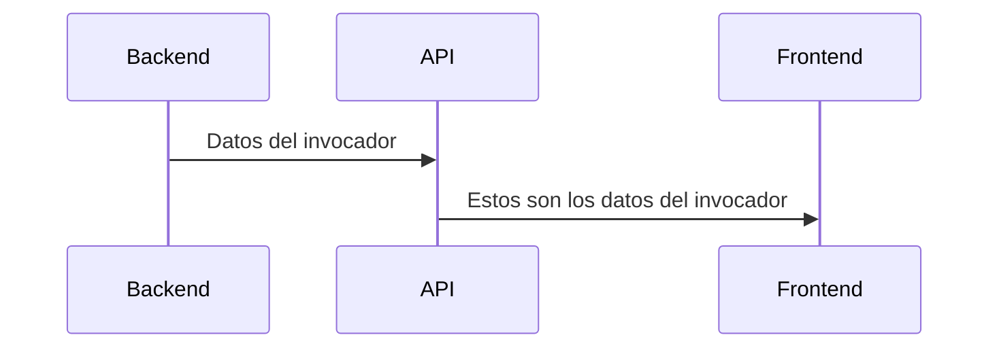

¡Hola! Bienvenido a el API core de [Report.gg](https://github.com/SebastianHerrera/Report.gg)

Report, es una web dedicada a LATAM para la obtención de datos de campeones e invocadores en League of Legends.

## Colaborar
Si estás interesado en colaborar en el desarrollo de la app, no lo pienses ni dos veces! Puedes hacer fork libremente.

## Recursos

Report usa diferentes librerías, entre las más importantes está [Cassiopeia](https://github.com/meraki-analytics/cassiopeia).
A su vez, usamos los datos que nos proporciona Riot mediante [Riot API](https://developer.riotgames.com/)

## ¿Cómo funciona?

¡Es fácil! Este es el backend, puedes ver el front-end que está desarrollado en React aquí: [Report.gg](https://github.com/SebastianHerrera/Report.gg)

> TODO: Añadir imagen del diagrama de secuencia  ^^

### Disclaimer

Report.gg isn't endorsed by Riot Games and doesn't reflect the views or opinions of Riot Games or anyone officially involved in producing or managing Riot Games properties. Riot Games, and all associated properties are trademarks or registered trademarks of Riot Games, Inc.
